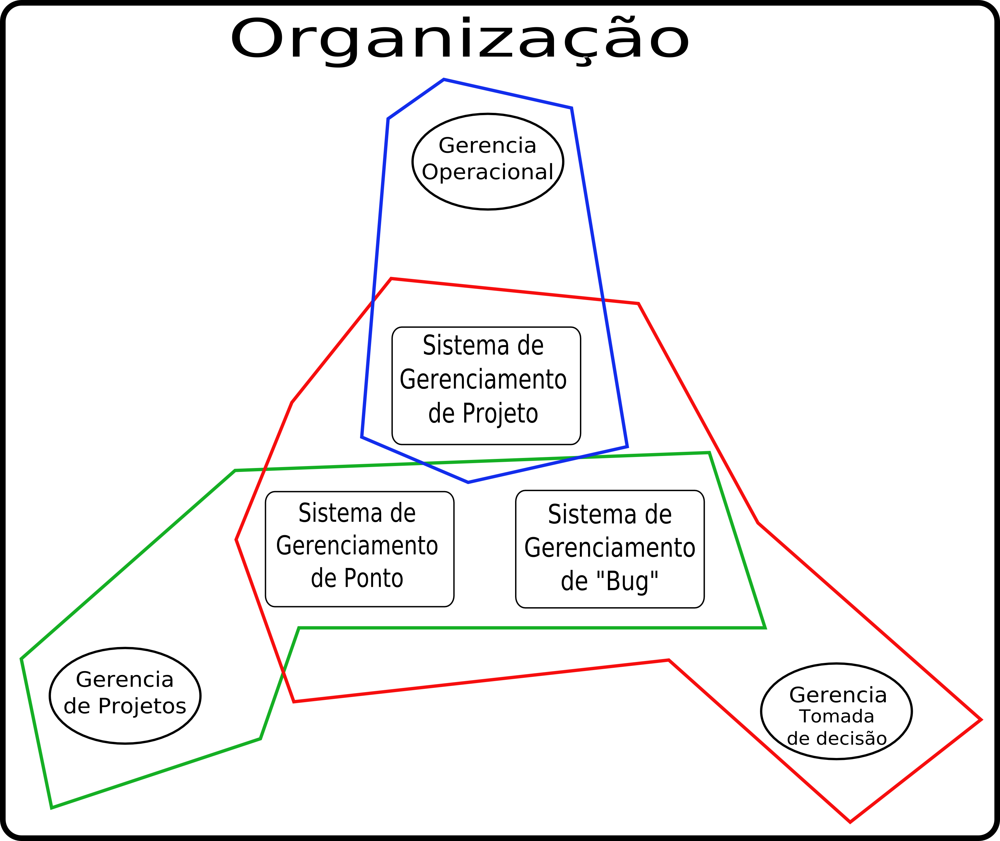

- ***Universidade Estadual do Oeste do Paraná***
- ***Ciência da Computação - Engenharia da Informação***
- ***Professora Ana Paula - 09/2005***

Plamejamento Estratégico de Sistema de Informação
=================================================

Autores
-------

- Eder Ruiz Maria
- Marcelo Pecenin
- Natalia Ghattas

Pré-Planejamento
================

Objetivos
---------

Os objetivos deste planejamento estratégico são de forma geral apoiar a
tomada de decisões dos gerentes da organização, auxiliando-os na alocação
de recursos no processo de desenvolvimento de software e no controle do fluxo
de informações. Também é objetivo deste planejamento definir uma arquitetura
de tecnologia da informação que atenda aos objetivos e as necessidades de
negócio da organização.

Escopo
------

Este planejamento está relacionado com o setor operacional da organização,
bem como no setor gerencial. Pois além de estar melhorando a forma de
operacionalização e funcionamento básico da organização, estará também
auxiliando a tomada de decisões no setor gerencial. Sendo assim o escopo deste
planejamento abrange as áreas operacionais e gerenciais.

Equipe
------

A equipe envolvida na execução e aplicação do planejamento, será basicamente
a gerência da organização, já que a princípio a organização não possui
uma equipe dedicada exclusivamente a área de sistemas de informação.

Problemas
---------

Alguns dos problemas detectados foram:

- Não há controle do horário de trabalho dos funcionários. Tanto na própria
organização, quanto o tempo utilizado para um ou outro projeto.

- Não há o acompanhamento eficiente dos projetos desenvolvidos pela
organização. Atualmente o acompanhamento é feito verbalmente.

- Não há uma forma eficiente de controle ou histórico de *bugs* de sistemas
de um certo projeto.

- Carência por um meio automatizado do cliente acompanhar o andamento do
projeto.

Planejamento
============

Nesta fase são utilizados os resultados das duas análises a seguir.

Análise Interna
---------------
	
A natureza do negócio consiste no serviço de desenvolvimento de sistemas
computacionais, utilizando processos em modelo de Fábrica de Software com
metodologias e padrões de qualidade. Os processos utilizados no desenvolvimento
dos sistemas foram definidos utilizando-se uma customização do RUP
(Rational Unified Process).

Para o alcance desses objetivos, ao iniciar um projeto é feita a análise do
projeto para verificar sua viabilidade. Em seguida, faz-se uma análise de
requisitos para definir a forma que o projeto deve ser desenvolvido. Para
distribuir as tarefas aos desenvolvedores, é feito um levantamento da
disponibilidade de cada um. Logo é feita a distribuição das tarefas para que
estes desenvolvam o projeto em si. Periodicamente o gerente de projeto questiona
os envolvidos para que esteja informado do andamento das atividades, verificando
se o projeto está cumprindo prazos e metas.

Segue-se o processo definido passando por fases de desenvolvimento até a
finalização do projeto. Se durante o desenvolvimento o desenvolvedor encontrar
alguma dificuldade, esta dificuldade é reportado verbalmente ao gerente de
projeto, e este decide o que fazer, novamente verbalmente avisa de sua decisão.

Analise Externa
---------------

A empresa esta localizada em Foz do Iguaçu, no estado do Paraná, no
condomínio empresarial do PTI desde maio de 2005.

Por estar instalada na Incubadora Empresarial do Parque Tecnológico Itaipu
(PTI) e com intuito de fortalecer seu potencial de geração de soluções
completas em desenvolvimento de software, fez parcerias com empresas, sendo
algumas delas incubadas, gerando novas oportunidades de negócio. O objetivo é
fornecer o máximo em qualidade e funcionalidade aos seus clientes, unindo
diferentes experiências para criar soluções para o seu negócio.

Alguns concorrentes diretos deste empreendimento são:

- DBA Engenharia de Sistemas (www.dba.com.br)
- ProcWork Informática (www.procwork.com.br)
- Consist (www.consist.com.br)

Existe a participação do cliente, que pode acompanhar o andamentodo projeto.
O acompanhamento do cliente é feito em forma de reunião periódica. O cliente
deve ir até a organização, ou o gerente de projeto deve ir até o cliente.

Após estas análises foi possível gerar o plano estratégico, descrito a seguir.

Plano Estratégico
=================

Objetivos e Atividades
----------------------
	
De acorodo com a análise feita anteriormente, foi constatadas as seguintes
necessidades:

1. Ferramenta de auxílio ao controle dos horários de trabalho dos
funcionários, disponibilidade dos mesmos. Para isso as seguintes atividades
deverão ser executadas:

 - Implantação de um sistema de web ponto, onde os funcionários, por meio
eletrônico, registram os horários de entrada e saída.

 - Implantar um sistema de registro de horários divididos em projetos.

2. Sistema de gerenciamento de projetos, onde é possível gerenciar o andamento
do projeto e atividades, verificar disponibilidade de funcionários, disseminar
informações pertinentes ao projeto, sendo algumas dessas informações
disponibilizadas ao cliente para acompanhamento do andamento do projeto. Para
isso as seguintes atividades deverão ser executadas:

 - Implantar um sistema semelhante ao DotProject, que faz o gerenciamento de um
projeto, suas atividades, responsabilidades, etc.

 - Treinar os funcionários para a utilização dessa ferramenta.

 - Apresentar essa ferramenta para o cliente para que este esteja a par do seu
projeto.

3. Sistema de gerenciamento e controle de *bugs*, onde é possível rastrear um
*bug*, atribuir ao responsável, verificar a solução, reabrir, etc.

 - Implantar um sistema *bug tracker* semelhante ao Bugzilla, que controla e
mantem histórico de “bugs”.

 - Treinar os funcionários para a utilização da ferramenta.

Arquitetura de Informações
--------------------------

Carteira de Aplicações
----------------------

As prioridades da implantação dos sistemas é a seguinte:

Sistema                              | Prioridade
-------------------------------------|-----------
Sistema de Gerenciamento de Projetos | Alta
Sistema de Gerenciamento de Horários | Baixa
Sistema de Gerenciamento de *Bugs*   | Média

Estratégia para Gerência de SI
------------------------------

A gerencia deverá fazer o acompanhamento da implantação dos sistemas
descritos, bem como o acompanhamento dos treinamentos. Identificando os pontos
fortes e fracos de cada sistema, possíveis mudanças necessárias, revisando o
plano estratégico quando necessário.

Devem também avaliar a utilização dos sistemas, tendo informações como
desempenho e produtividade de cada sistema de acordo com projetos e
funcionários.

Estratégia para TI
------------------

Sistemas que disponibilizam acesso remoto através da Web, podendo ser acessados
remotamente pelos envolvidos de forma eficiente. 

O sistemas devem prover mecanismos fáceis de *feedback* a gerencia, para que
esta tenha sempre em mãos informações atualizadas que auxiliam a tomada de
decisões.

Plano de Implantação
--------------------

Conclusão
---------
